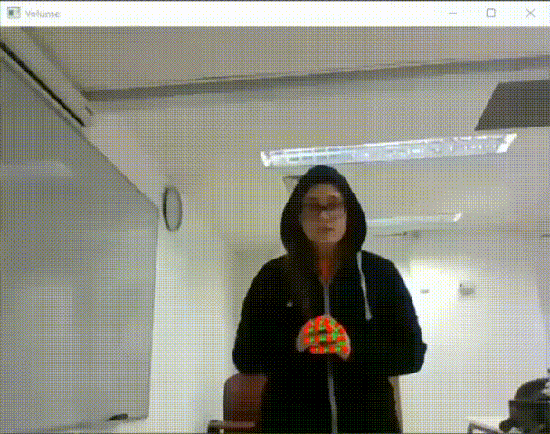

# Signal For Help
Using OpenCV and media pipe 
the program recognizes the universally known signal for help for victims of domestic abuse. 
The program recognizes the sequence of the symbol and sends an email with a screenshot.
Hackathon_2021

Demo:
ASS

An artical about the project:
https://www.inn.co.il/news/494169